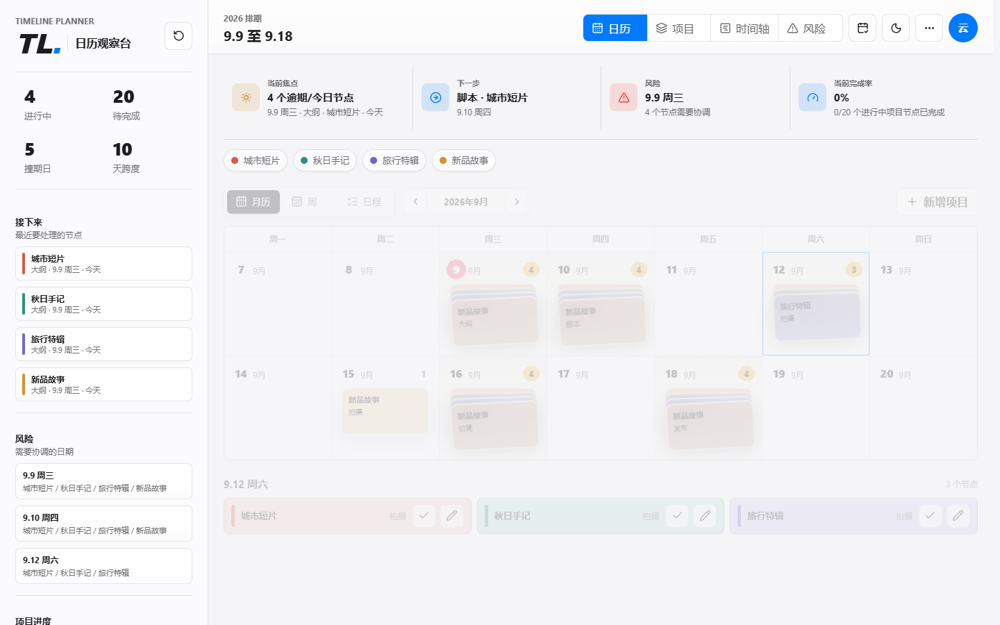

# TL 日历观察台

面向短视频项目排期的移动优先日历工具，支持智能粘贴、可选阶段、月历/周/日程、项目进度、时间轴、撞期提醒和 TL 一键复制。

[打开 TL 日历观察台](https://tl-calendar-planner-cn.netlify.app/)



### 每一个节点，都有自己的节奏

同日节点叠放，点击展开；拖动标签调整日期，在清晰的日历中安排大纲、脚本、拍摄、初稿和发布。


以上展示均为虚构项目，不包含真实账号或客户排期。动画为实际界面录制，具体表现因设备而异。

## 在线地址

- 主站：https://tl-calendar-planner-cn.netlify.app/
- 备用站：https://tl-calendar-planner.vercel.app/

## 发布绩效

“绩效”页按上月 16 日（含）到所选月份 15 日（含）统计已完成发布的视频，本月 16 日起归入下月。按平台分别计数，同时显示涉及的项目数。项目编辑中可填写抖音、小红书的视频数量和实际发布日期；日期留空时使用发布节点日期。未补平台的历史项目单独列出，不猜测其归属。

当月预计提成取三个月前的绩效周期，例如 9 月对应 6 月绩效（5 月 16 日至 6 月 15 日）。计算为 `(抖音条数 * 54000 + 小红书条数 * 20000) / 2 * 10%`，即每条抖音 2700 元、小红书 1000 元。未完成或未来日期的视频不计入，实际金额以公司结算为准。平台信息使用现有项目 JSON 同步与备份，无需迁移数据库。

## 数据保护

应用使用 Supabase 邮箱账号同步，采用项目级版本控制：

- 每个项目独立保存，不再整包覆盖全部数据。
- 写入时校验服务端版本，并发修改不会静默覆盖。
- 冲突时以云端版本为准，本机修改保留在恢复记录中，不自动生成重复项目。
- 云端自动保留最近 50 份完整快照。
- 浏览器本机自动保留最近 20 份恢复点。
- 旧版 `timeline_data` 表保留，升级时不会删除历史数据。
- 未登录不展示项目；登录后只加载对应账号的云端排期。

登录后从右上角账户窗口进入“恢复记录”，可以恢复云端或本机版本。

## 本地运行

```powershell
npm install
npm run build:vendor
python -m http.server 8765 --bind 127.0.0.1
```

打开 `http://127.0.0.1:8765/`。纯本地模式不会连接云端 API。

## 数据库

首次安装或升级数据库：

```powershell
npx supabase link --project-ref <project-ref>
npx supabase db push --linked
```

数据库迁移位于 `supabase/migrations/`，`supabase-schema.sql` 可用于新项目手动初始化。

需要在 Supabase Authentication 的 URL Configuration 中加入正式站点，并将生产域名设置为 Site URL。

## 构建与检查

```powershell
npm run check
npm run build:netlify
npm run build:edgeone
```

图标和 Supabase 客户端均打包在 `vendor/`，线上运行不依赖第三方 CDN。Netlify 与 EdgeOne 构建产物分别输出到 `output/netlify/` 和 `output/edgeone/`。

构建只打包实际使用的图标，并压缩发布产物中的 JavaScript/CSS，源文件保持可读。构建不再请求 Vercel 或依赖 PowerShell：若设置下方环境变量，会写入构建目录中的运行配置；未设置时需由部署平台在运行时提供。不要使用旧的 `inject-*-config.ps1` 脚本。

## 部署变量

部署平台需要配置以下公开客户端参数：

- `SUPABASE_URL`
- `SUPABASE_ANON_KEY`

Anon Key 是 Supabase 设计用于浏览器公开使用的客户端密钥，数据访问由数据库 RLS 和登录令牌控制。不要在仓库中保存 Service Role Key、数据库密码或 Supabase Personal Access Token。

## 安全边界

- 数据表启用 RLS，每个账号只能读取自己的项目和快照。
- 云端写入只能通过带版本校验的数据库函数完成。
- 部署代理限制请求来源、路径、方法、请求体积、频率和超时时间。
- 页面启用 CSP、禁止 iframe 嵌入，并限制摄像头、麦克风和定位权限。
- Service Worker 只缓存静态应用文件，不缓存登录和云端数据接口。
